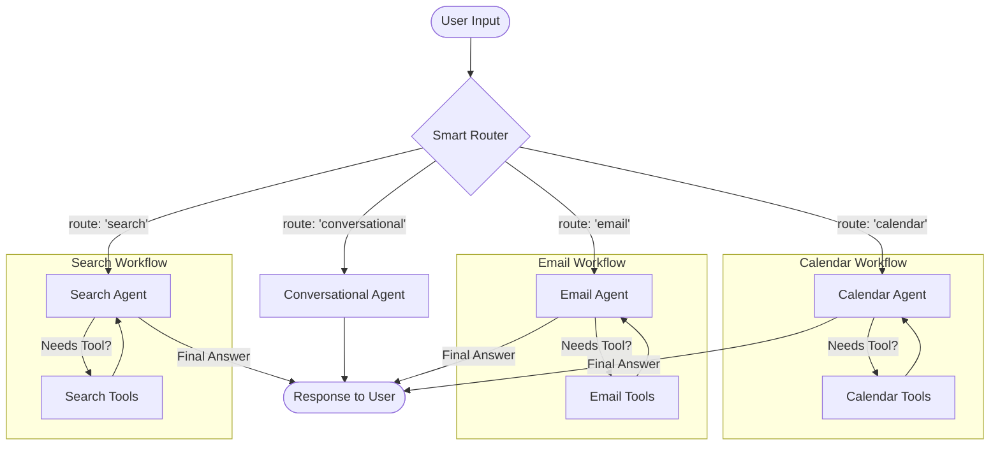

# Personal AI Assistant


A conversational AI assistant that connects to your Google services to help you manage your calendar, read and summarize your emails, answer questions via web search, and hold natural conversations with persistent memory.

This project is built upon an advanced Router Architecture, which intelligently delegates tasks to specialized expert agents rather than relying on a single monolithic agent.

---

## Architectural Features

- **Advanced Agentic Architecture:** At the core of the project is a "Smart Router" that analyzes user requests and delegates the task to the correct expert: Calendar, Email, Search, or Conversational. This makes the system more modular, efficient, and scalable.

- **Specialized Expert Agents:** Each task area (Calendar, Email, etc.) is handled by a dedicated "Expert Agent" that only knows about its own set of tools and rules. This increases accuracy and reduces errors.

- **Safe, Multi-Step Workflows:** The agent can reliably handle complex, multi-turn tasks, such as requiring user confirmation before deleting a calendar event, ensuring a safe and predictable user experience.

- **Persistent Conversation Memory:** Utilizes LangGraph's SQLite-based checkpointer system to remember conversations, allowing you to stop and resume your session at any time.

- **Conversational AI Core:** Powered by LangGraph and Groq's Llama 3 for stateful, low-latency conversations.

- **Advanced Google Calendar Integration:**

  + **Natural Language Understanding:** Parses queries like "tomorrow at 4 PM" or "next week" into precise dates and times, powered by the `parsedatetime` library.

   + **Intelligent Event Creation:** Automatically checks for scheduling conflicts before adding new events to your calendar.

   + **Event Management:** Modifies existing events with simple commands like "Move my meeting to 5 PM" and deletes events with a confirmation step.
  

- **Gmail Integration:**

   + **Intelligent Filtering & Summarization:** Filters emails by sender, status (read/unread), and time range (e.g., "last 2 days") and summarizes their content.

- **General Knowledge Q&A:** Uses the Tavily Search API to answer questions about real-time events, facts, and general knowledge.


- **Interactive Notebook Environment:** All development and interaction happens within a single, easy-to-use `assistant.ipynb` file.

---

## Architecture Diagram

The assistant operates on a router-based agentic architecture. All user input is first evaluated by a "Smart Router" which then delegates the task to the appropriate specialized expert.



---

## Technologies Used

- **Core Framework:** LangChain & LangGraph for building the stateful agent.
- **LLM:** `llama-3.3-70b-versatile` via the Groq API for high-speed, low-latency responses
- **External Services:**
  - Google Calendar API
  - Google Gmail API
  - Tavily Search API
- **Key Python Libraries:**
  - `google-api-python-client` & `google-auth-oauthlib` for Google API authentication.
  - `parsedatetime` for robust natural language date/time parsing.
  - `Pydantic` for reliable data validation and modeling.
  - `python-dotenv` for secure management of API keys.
- **Database:** SQLite, used by LangGraph's checkpointer for persistent conversation memory.


---


##  Setup & Installation

Follow these steps to get your local environment set up and ready to run the assistant.

**1. Clone the Repository:**

```bash
git clone https://github.com/berkyalkn/ai-personal-assistant.git
cd ai-personal-assistant
```

**2. Create a Virtual Environment and Install Dependencies:**

```bash
# Create a virtual environment
python -m venv venv

# Activate it (macOS/Linux)
source venv/bin/activate
# Or (Windows)
.\venv\Scripts\activate

# Install required packages
pip install -r requirements.txt
```

**3. Create and Configure the `.env` File:**

- In the root of the project, create a new file named `.env`.

-  Copy the contents of the `.env.example` file below into your new `.env` file and fill in your own credentials.


**.env.example:**

```
# Groq API Key for the LLM
GROQ_API_KEY="gsk_YourGroqApiKey"

# Tavily API Key for web search
TAVILY_API_KEY="tvly-YourTavilyApiKey"

```


**4. Configure Google API Access:**

- Go to the [Google Cloud Console](https://console.cloud.google.com/)

- Create a new project.

- Go to "APIs & Services" > "Library" and enable the "Google Calendar API" and the "Gmail API".

- Go to "OAuth consent screen", select "External", and fill in the required app details. Add your own Google account as a "Test user".

- Go to "Credentials", click "+ CREATE CREDENTIALS", and select "OAuth client ID".

- Choose "Desktop app" as the application type.

- After creation, click the "DOWNLOAD JSON" button.

- Rename the downloaded file to `credentials.json` and place it in the root of your project directory.

**Note:** The first time you run a calendar command, you will be prompted to authorize the application in your browser. This will generate a `token.json` file. This is a one-time process.

---

## How to Run

1- Open the `assistant.ipynb` file in Jupyter Notebook, JupyterLab, or Visual Studio Code.

2- Run the cells in order from top to bottom.

3- The final cell will start an interactive chat loop. You can start talking to your assistant directly in the notebook's output.

4- To continue a previous conversation, ensure the thread_id in the code is the same. To start a new one, change the thread_id.

--- 

## Example Usage

```
Your assistant is ready. You can now start chatting.
   Type 'quit' or 'exit' to end the conversation.
-------------------------
You: What's on my schedule for tomorrow?
Assistant: You have a 'Dentist Appointment' scheduled for tomorrow at 11:00 AM.

You: Please cancel the Dentist Appointment.
Assistant: I found the 'Dentist Appointment' for tomorrow. Are you sure you want to cancel it?

You: Yes, please.
Assistant: The 'Dentist Appointment' has been successfully removed from your calendar.

You: Add a 'Team Lunch' to my calendar for next Friday at 1 PM.
Assistant: Of course, and how long will the event be?

You: It will be 90 minutes.
Assistant: Done. I've added 'Team Lunch' to your calendar for next Friday at 1:00 PM.

You: Are there any unread emails from 'Google'?
Assistant: Let me check... Yes, you have one unread email from 'Google' with the subject 'Security alert', summarizing that a new device has signed into your account.
